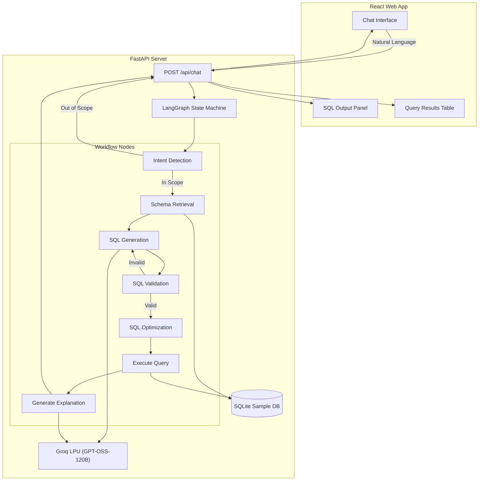

# SQL Query AI Agent

A task-oriented AI agent that translates natural language into SQL queries using LangGraph, FastAPI, and React. 

## 1. Architecture Diagram



## 2. LangGraph Workflow Explanation

The AI Agent is orchestrated using **LangGraph**, providing a cyclic graph capable of validating and regenerating SQL if needed.

1. **detect_intent**: Analyzes the user request against conversation history using LLM. Routes to `reject_out_of_scope` if unrelated to SQL/DB.
2. **retrieve_schema**: Fetches the SQLite schema to provide context to the LLM.
3. **generate_sql**: Uses the LLM to write a SQL query based on the schema and request.
4. **validate_sql**: Parses the SQL using `sqlglot`. Rejects any non-SELECT statements (DELETE, DROP, etc.) or syntax errors. If invalid, the graph routes *back* to `generate_sql` with the error message to retry.
5. **optimize_sql**: Formats the valid SQL query for readability.
6. **execute_query**: Runs the query securely against the local sample SQLite database.
7. **generate_explanation**: Uses the LLM to explain the query in plain English.
8. **format_response**: Assembles the final payload and sends it back to the frontend.

## 3. Setup Instructions

### Option A: Dockerized Deployment (Recommended)
You can build and run both the FastAPI backend and React frontend with a single command:

```bash
# 1. Set your Groq API key in backend/.env
echo "GROQ_API_KEY=your_groq_api_key_here" > backend/.env

# 2. Build and launch all containers
docker compose up --build
```
* **Frontend UI**: `http://localhost:3000` (served with Nginx reverse proxy)
* **Backend API**: `http://localhost:8000`

---

### Option B: Local Manual Setup

#### Prerequisites
- Python 3.10+
- Node.js 18+
- Groq API Key (`GROQ_API_KEY`)

#### Backend Setup
```bash
cd backend
python3 -m venv venv
source venv/bin/activate
pip install -r requirements.txt

# Create .env file with your GROQ_API_KEY
echo "GROQ_API_KEY=your_key_here" > .env

# Run the server
uvicorn app.main:app --reload --port 8000
```

#### Frontend Setup
```bash
cd frontend
npm install
npm run dev
```
Open `http://localhost:5173` in your browser.

---

## 4. Unit and Integration Tests

A comprehensive test suite covering all functional criteria, security guardrails, and API endpoints is provided in `backend/test_suite.py`:

```bash
cd backend
python test_suite.py
```

### What is tested:
1. **`TestDatabaseService`**: SQLite connection, schema introspection (`Employees`, `Departments`, `Customers`), read queries, and exception handling.
2. **`TestSQLValidationAndSecurity`**:
   - Read-only AST validation (only `SELECT` queries allowed).
   - Destructive operations blocked (`DROP`, `DELETE`, `UPDATE`, `ALTER`, `TRUNCATE`).
   - Stacked SQL injection defense (`SELECT ...; DROP TABLE ...;--`).
   - Anti-hallucination verification via SQLite `EXPLAIN` (rejects non-existent tables/columns).
3. **`TestLangGraphAgentWorkflow`**: In-scope query translation and out-of-scope intent refusal.
4. **`TestFastAPIChatEndpoint`**: Full HTTP integration on `/api/chat` with multi-turn conversation context retention.

---

## 5. Prompts Used
1. **Intent Detection:**
   *"Analyze the user's request and the conversation history. Determine if the request is related to querying a database, SQL, or retrieving data about employees, departments, or customers. If it is about sports, politics, general knowledge, or creative writing, it is OUT OF SCOPE."*
2. **SQL Generation:**
   *"You are an expert SQL assistant. Generate a SQL query for SQLite based on the user's request. Rules: 1. Only use the provided tables/columns. 2. Write standard read-only SQL. 3. If there were previous errors with your SQL, fix them."*
3. **Explanation Generation:**
   *"Explain the following SQL query in plain, clear English. Focus on what data it retrieves."*

---

## 6. Bonus Features Implemented
* 🐳 **Dockerized Deployment**: Complete multi-stage `Dockerfile` and `docker-compose.yml` for zero-configuration startup.
* 🧪 **Unit and Integration Tests**: 13 comprehensive unit, integration, and security tests in `test_suite.py`.
* 🛡️ **Multi-layer SQL & Prompt Injection Protection**: SQLGlot AST validation + destructive keyword blocklist + pre-flight SQLite `EXPLAIN` anti-hallucination.
* ⚡ **Query Execution & Latency Profiling**: High-precision monotonic execution timing (`time.perf_counter()`) measuring database latency in milliseconds.
* 🔄 **Flexible Layout & Query Selector**:
  - Horizontal drag-to-resize split pane with layout presets (`💬 Chat Focus`, `⚖️ 50/50`, `📊 Query Focus`).
  - Multi-turn query selector allowing users to inspect and navigate between any query in the session.
* 💾 **Data Export**: One-click download of generated query (`.sql`) and live results in both **CSV** and **JSON** formats.
* 🌙 **Dark Mode**: Persistent dark/light theme switchable via top navbar.
* ⚡ **Groq LPU Acceleration**: Powered by `openai/gpt-oss-120b` for ultra-fast, quota-resilient inference.
