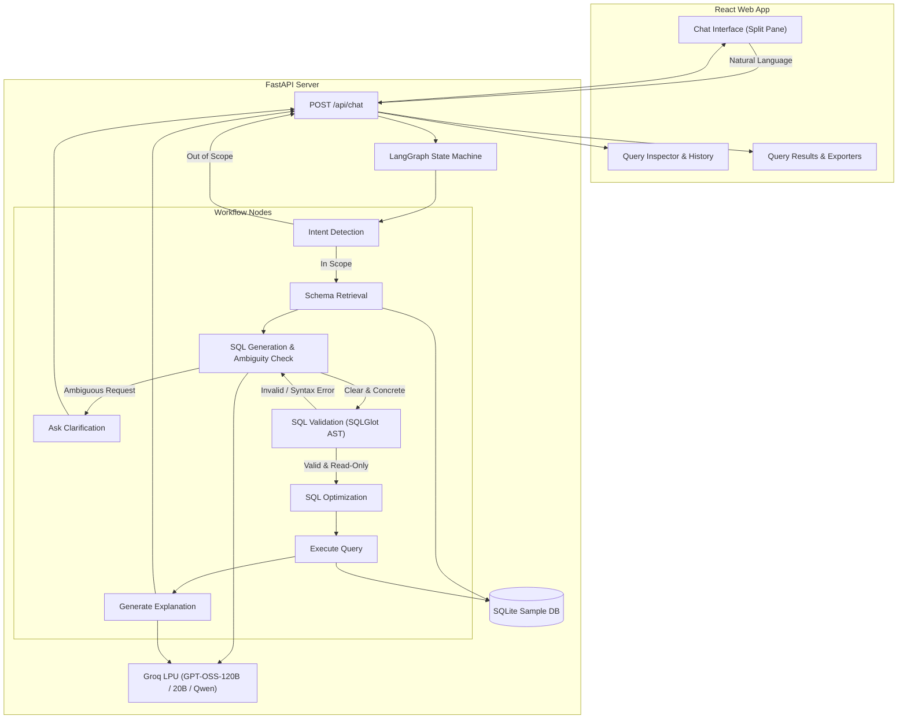

# SQL Query AI Agent

A task-oriented AI agent that translates natural language into verified SQL queries using LangGraph, FastAPI, and React. Powered by Groq LPU inference with automatic multi-model failover and proactive ambiguity clarification.

## 1. Architecture Diagram



## 2. LangGraph Workflow Explanation

The AI Agent is orchestrated using **LangGraph**, providing a cyclic state machine capable of validating SQL, clarifying ambiguities, preventing security policy violations, and regenerating queries if needed.

1. **`detect_intent`**: Analyzes user input against multi-turn conversation history. Routes to `reject_out_of_scope` if the request is unrelated to querying data (e.g. sports, politics, general chat).
2. **`retrieve_schema`**: Fetches the active SQLite schema (`Employees`, `Departments`, `Customers`).
3. **`generate_sql` (with Ambiguity Detection)**: 
   - Uses the LLM to write SQL. 
   - **Proactive Ambiguity Detection**: If the user prompt uses undefined or subjective criteria (e.g., *"Show the best employee"*, *"Find top customers"*, *"Longest employee"*), it flags `is_ambiguous=True` and produces a polite, specific clarifying question offering schema-based choices instead of guessing arbitrary metrics.
   - For concrete, well-defined queries (e.g., *"Show all employees hired after 2023"*, *"Customers in California"*), it directly generates the corresponding executable SQLite query.
4. **`ask_clarification`**: Routes ambiguous requests back to the user without executing arbitrary SQL, preserving conversation state so the user's follow-up answer immediately completes the query.
5. **`validate_sql`**: For unambiguous queries, parses the SQL Abstract Syntax Tree (AST) via `sqlglot`. Blocks destructive operations (`DROP`, `DELETE`, `UPDATE`, `ALTER`, `TRUNCATE`, stacked queries) and checks column/table validity via SQLite `EXPLAIN`. Invalid queries route back to `generate_sql` for self-correction.
6. **`optimize_sql`**: Formats the valid SQL query for clean readability.
7. **`execute_query`**: Runs the read-only query against the SQLite database and measures precise execution latency (`time.perf_counter()`).
8. **`generate_explanation`**: Uses the LLM to formulate a plain-English, step-by-step breakdown.
9. **`format_response`**: Assembles the complete response payload for the React frontend.

## 3. High Availability & Multi-Model Fallback

To prevent downtime and avoid quota exhaustion on Groq's free tier, the backend includes an automated multi-model fallback chain:
1. Primary: `openai/gpt-oss-120b` (highest reasoning capacity)
2. Secondary: `openai/gpt-oss-20b` (fast, efficient failover)
3. Tertiary: `qwen/qwen3.8-27b` (high-throughput alternative)

If a provider returns a `429 RateLimitError` (daily token limit reached), the system automatically retries with the next available model without failing the user request. In addition, natural language queries are strictly protected from being mistaken for SQL syntax errors.

## 4. Setup Instructions

### Option A: Dockerized Deployment (Recommended)
You can build and run both the FastAPI backend and React frontend with a single command:

```bash
# 1. Set your Groq API key in backend/.env
echo "GROQ_API_KEY=your_groq_api_key_here" > backend/.env

# 2. Build and launch all containers
docker compose up --build
```
* **Frontend UI**: `http://localhost:3000` (served with Nginx reverse proxy)
* **Backend API**: `http://localhost:8000`

---

### Option B: Local Manual Setup

#### Prerequisites
- Python 3.10+
- Node.js 18+
- Groq API Key (`GROQ_API_KEY`)

#### Backend Setup
```bash
cd backend
python3 -m venv venv
source venv/bin/activate
pip install -r requirements.txt

# Create .env file with your GROQ_API_KEY
echo "GROQ_API_KEY=your_key_here" > .env

# Run the server
uvicorn app.main:app --reload --port 8000
```

#### Frontend Setup
```bash
cd frontend
npm install
npm run dev
```
Open `http://localhost:5173` in your browser.

---

## 5. Unit and Integration Tests

A comprehensive test suite covering all functional criteria, security guardrails, ambiguity handling, and API endpoints is provided in `backend/test_suite.py`:

```bash
cd backend
venv/bin/python test_suite.py
```

### What is tested (14 Automated Tests, 100% Passing):
1. **`TestDatabaseService`**: SQLite connection, schema introspection (`Employees`, `Departments`, `Customers`), read queries, and exception handling.
2. **`TestSQLValidationAndSecurity`**:
   - Read-only AST validation (only `SELECT` queries allowed).
   - Destructive operations blocked (`DROP`, `DELETE`, `UPDATE`, `ALTER`, `TRUNCATE`).
   - Stacked SQL injection defense (`SELECT ...; DROP TABLE ...;--`).
   - Anti-hallucination verification via SQLite `EXPLAIN` (rejects non-existent tables/columns).
3. **`TestLangGraphAgentWorkflow`**: In-scope query translation and out-of-scope intent refusal.
4. **`TestFastAPIChatEndpoint`**:
   - Valid query generation and execution with timing.
   - Guardrail rejection on destructive inputs.
   - Multi-turn conversation context retention (`"Show customers in California"` followed by `"and in Los Angeles only?"`).
   - **Ambiguity Detection & Clarification Lifecycle**: Turn 1 asks for clarification on `"Show me the best employee"`; Turn 2 answers `"Highest salary"` and immediately executes `SELECT * FROM Employees ORDER BY Salary DESC`.

---

## 6. Prompts Used

1. **Intent Detection:**
   *"Analyze the user's request and the conversation history. Determine if the request is related to querying a database, SQL, or retrieving data about employees, departments, or customers. If it is about sports, politics, general knowledge, or creative writing, it is OUT OF SCOPE."*

2. **SQL Generation & Ambiguity Detection:**
   *"You are a task-oriented SQL query assistant for SQLite. Database Schema: {schema}. Instructions: 1. Ambiguity Detection: If the request is ambiguous or subjective (e.g. 'best employee', 'top customers'), set is_ambiguous=True and ask a polite clarifying question with concrete options based on schema columns. If the request has clear column filters, dates, or aggregates, set is_ambiguous=False and generate the executable SQLite query. 2. Output any destructive commands directly so security validator can block them. 3. NEVER hallucinate non-existent tables or columns."*

3. **Explanation Generation:**
   *"Explain the following SQL query in plain, clear English. Focus on what data it retrieves."*

---

## 7. Features & Bonuses Implemented

* 💡 **Proactive Ambiguity Handling**: Detects subjective queries and asks targeted clarifying questions before executing SQL.
* 🛡️ **Multi-layer SQL & Prompt Injection Protection**: SQLGlot AST validation + destructive keyword blocklist + pre-flight SQLite `EXPLAIN` anti-hallucination.
* 🔄 **Resilient Multi-Model Fallback**: Automatically switches across `openai/gpt-oss-120b`, `openai/gpt-oss-20b`, and `qwen/qwen3.8-27b` if Groq rate limits are encountered.
* 🐳 **Dockerized Deployment**: Multi-stage `Dockerfile` and `docker-compose.yml` for unified frontend and backend deployment.
* 🧪 **Unit and Integration Tests**: 14 comprehensive tests in `test_suite.py` validating 100% of pipeline nodes and HTTP endpoints.
* ⚡ **Query Latency Profiling**: Monotonic timing (`time.perf_counter()`) displaying SQLite execution latency in milliseconds.
* 🎛️ **Flexible Split-Pane Layout**:
  - Horizontal drag-to-resize divider with layout presets (`💬 Chat Focus`, `⚖️ 50/50`, `📊 Query Focus`).
  - In-chat query selector cards and inspector dropdown navigation for multi-turn conversations.
* 💾 **Data Export**: One-click download of generated queries (`.sql`) and live execution records in both **CSV** and **JSON** formats.
* 🌙 **Dark & Light Mode**: Curated theme styling with persistence across browser refreshes.
