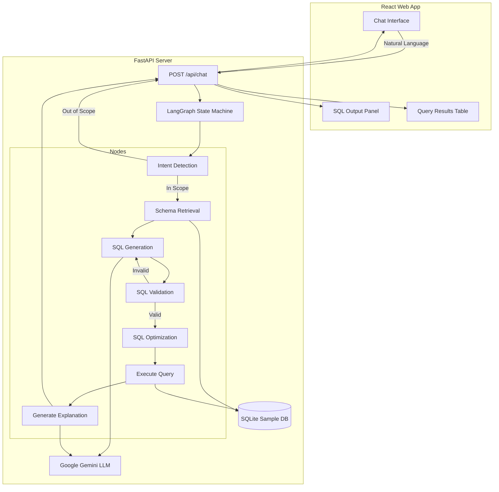

# SQL Query AI Agent

A task-oriented AI agent that translates natural language into SQL queries using LangGraph, FastAPI, and React. 

## 1. Architecture Diagram



## 2. LangGraph Workflow Explanation

The AI Agent is orchestrated using **LangGraph**, providing a cyclic graph capable of validating and regenerating SQL if needed.

1. **detect_intent**: Analyzes the user request against conversation history using LLM. Routes to `reject_out_of_scope` if unrelated to SQL/DB.
2. **retrieve_schema**: Fetches the SQLite schema to provide context to the LLM.
3. **generate_sql**: Uses the LLM to write a SQL query based on the schema and request.
4. **validate_sql**: Parses the SQL using `sqlglot`. Rejects any non-SELECT statements (DELETE, DROP, etc.) or syntax errors. If invalid, the graph routes *back* to `generate_sql` with the error message to retry.
5. **optimize_sql**: Formats the valid SQL query for readability.
6. **execute_query**: Runs the query securely against the local sample SQLite database.
7. **generate_explanation**: Uses the LLM to explain the query in plain English.
8. **format_response**: Assembles the final payload and sends it back to the frontend.

## 3. Setup Instructions

### Prerequisites
- Python 3.10+
- Node.js 18+
- A Google Gemini API Key (`GOOGLE_API_KEY`)

### Backend Setup
```bash
cd backend
python3 -m venv venv
source venv/bin/activate
pip install -r requirements.txt # (or just install dependencies listed below)
# Dependencies: fastapi uvicorn langchain langgraph langchain-google-genai pydantic sqlalchemy sqlglot
export GOOGLE_API_KEY="your-api-key"

# Initialize sample database (creates sample.db)
python scripts/init_db.py

# Run the server
uvicorn app.main:app --reload --port 8000
```

### Frontend Setup
```bash
cd frontend
npm install
npm run dev
```
Open `http://localhost:5173` in your browser.

## 4. Prompts Used
1. **Intent Detection:**
   *"Analyze the user's request and the conversation history. Determine if the request is related to querying a database, SQL, or retrieving data about employees, departments, or customers. If it is about sports, politics, general knowledge, or creative writing, it is OUT OF SCOPE."*
2. **SQL Generation:**
   *"You are an expert SQL assistant. Generate a SQL query for SQLite based on the user's request. Rules: 1. Only use the provided tables/columns. 2. Write standard read-only SQL. 3. If there were previous errors with your SQL, fix them."*
3. **Explanation Generation:**
   *"Explain the following SQL query in plain, clear English. Focus on what data it retrieves."*

## 5. Bonus Features Implemented
- **SQL Execution**: Executes read-only queries against a sample SQLite database.
- **Dynamic Frontend**: Modern UI with glassmorphism, animations, and dark mode support.
- **SOLID Architecture**: Clean code on the backend using Dependency Injection (LLM Service, DB Service).
